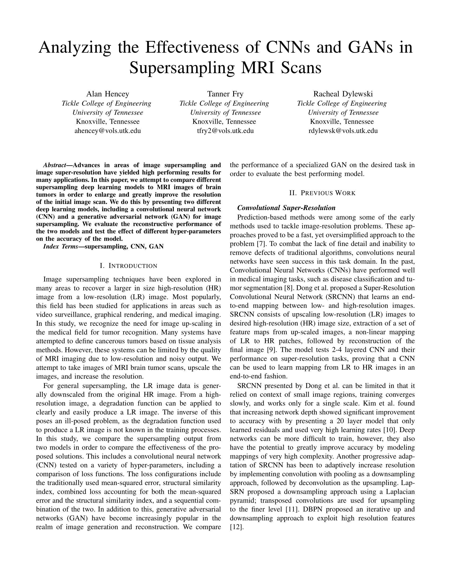
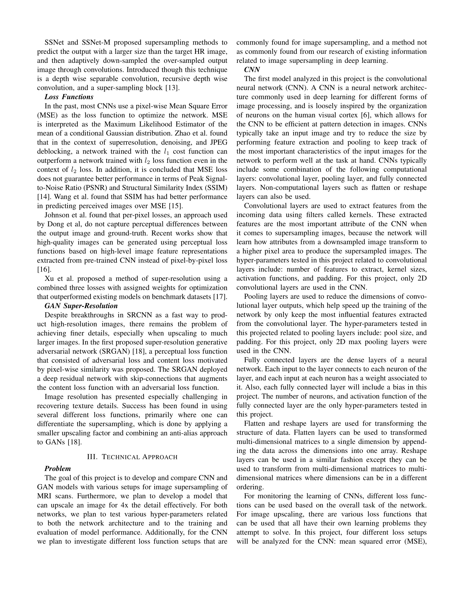
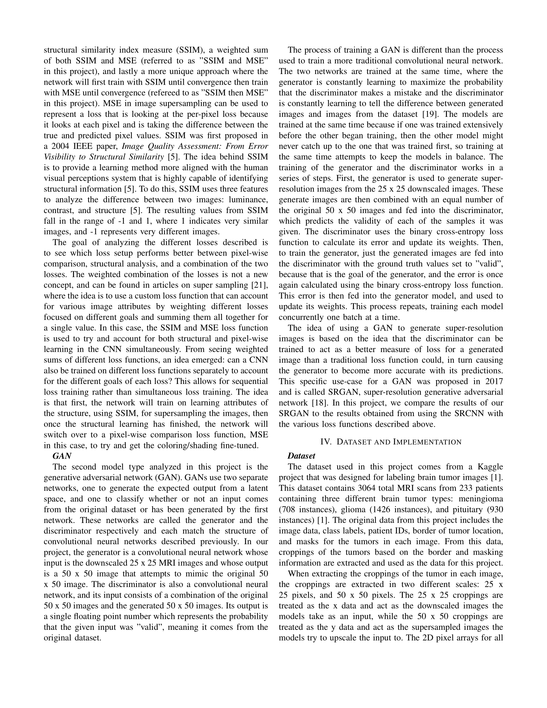
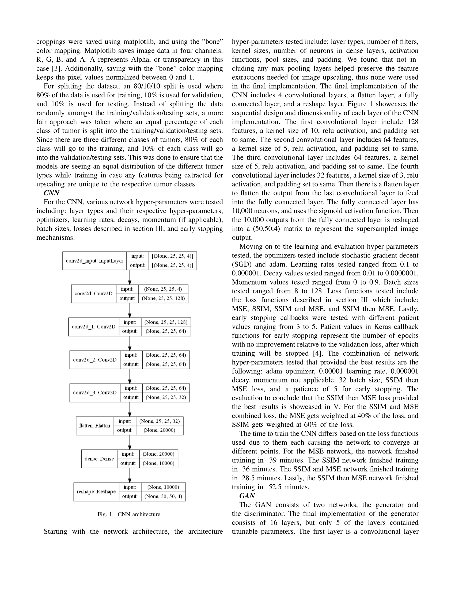
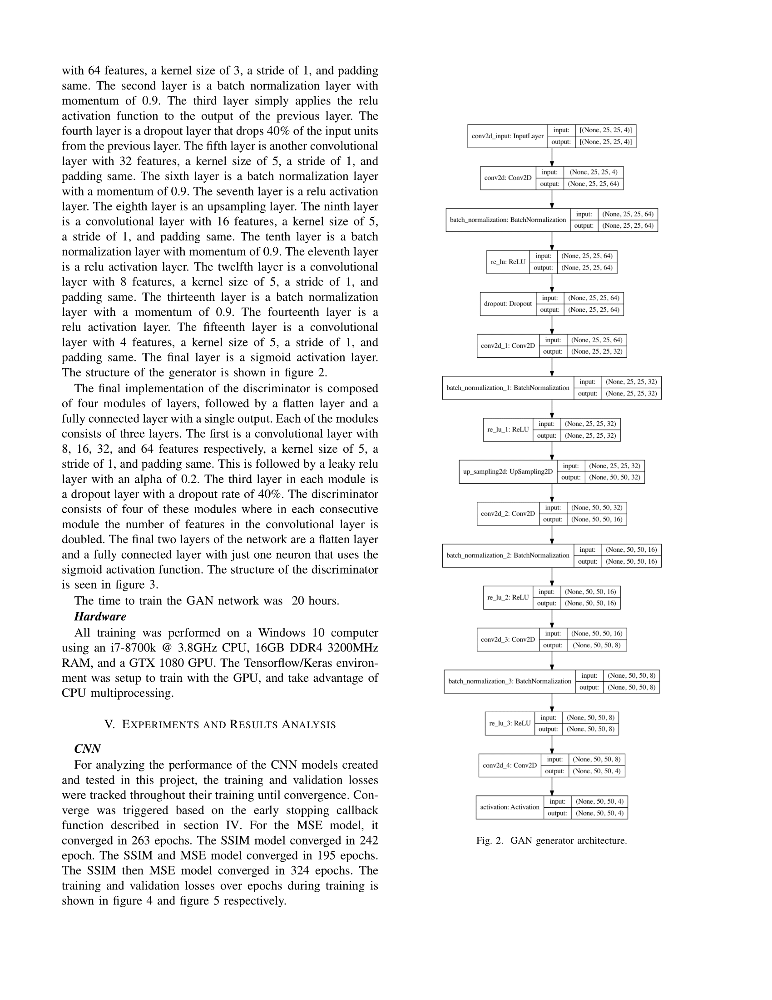
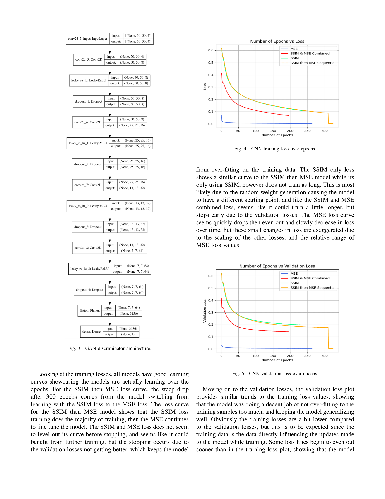
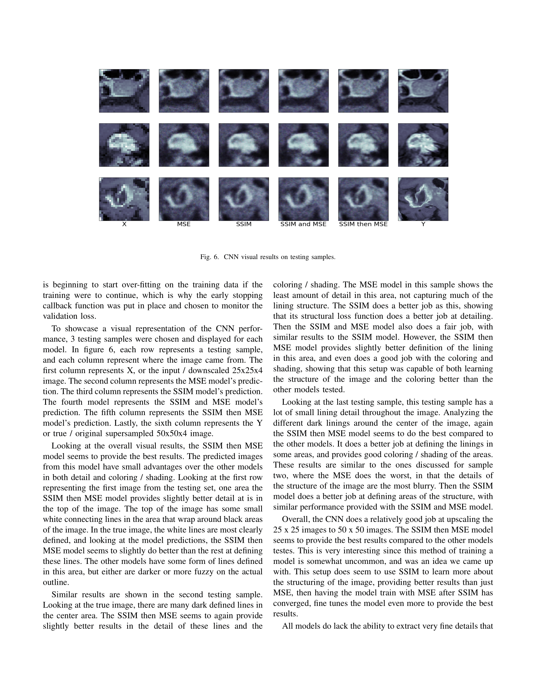
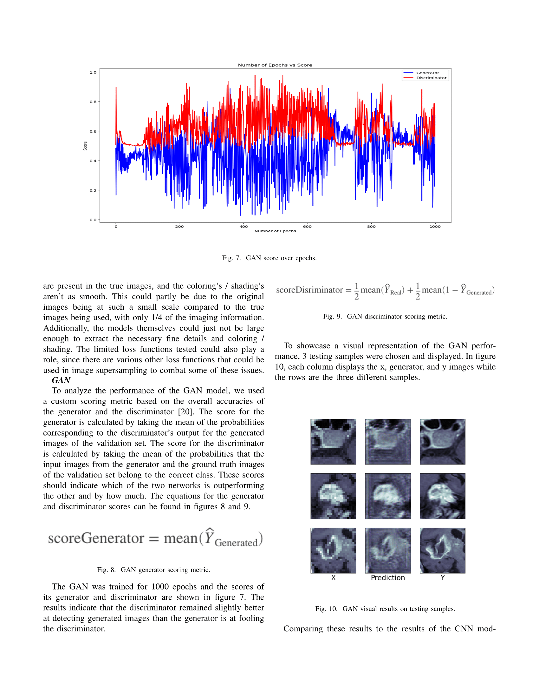
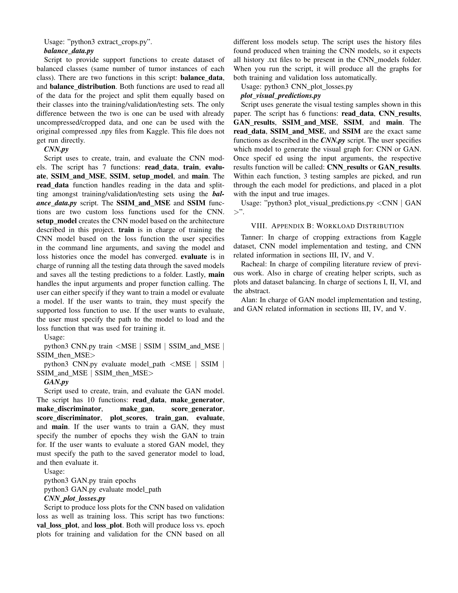

# Deep Learning Project for Analyzing the Effectiveness of CNNs and GANs in Supersampling MRI Scans
[Original Dataset](https://www.kaggle.com/awsaf49/brain-tumor)

[CNN and GAN pre-trained models w/ testing data predictions](https://drive.google.com/drive/folders/1WqjAK_SKaY6UdsOL7gdzPz2D0j_Ty3Tk?usp=sharing)

[See Full Project Report](https://github.com/TannerFry/MRI-Image-Upscaling/blob/main/CS525_FinalProjectReport.pdf)

